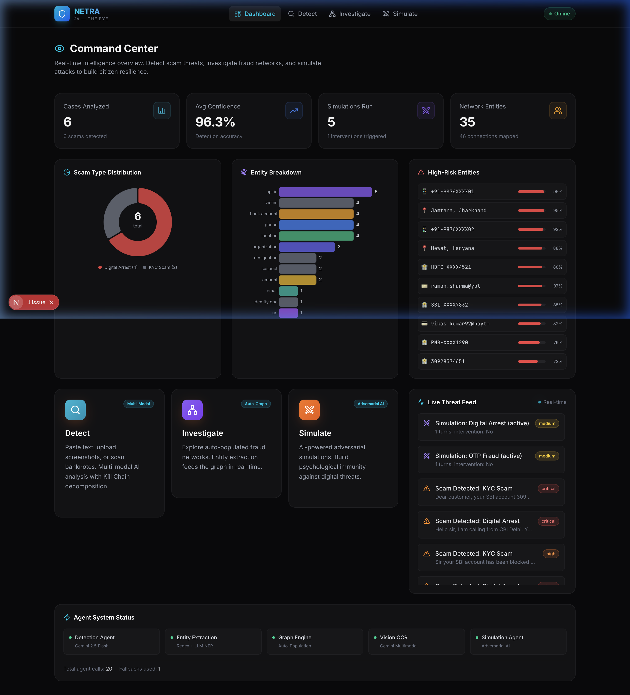
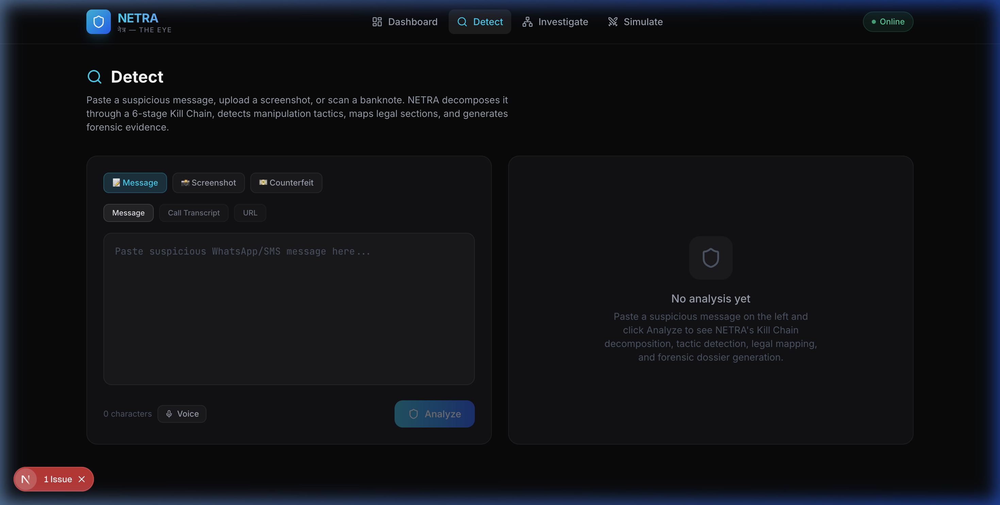
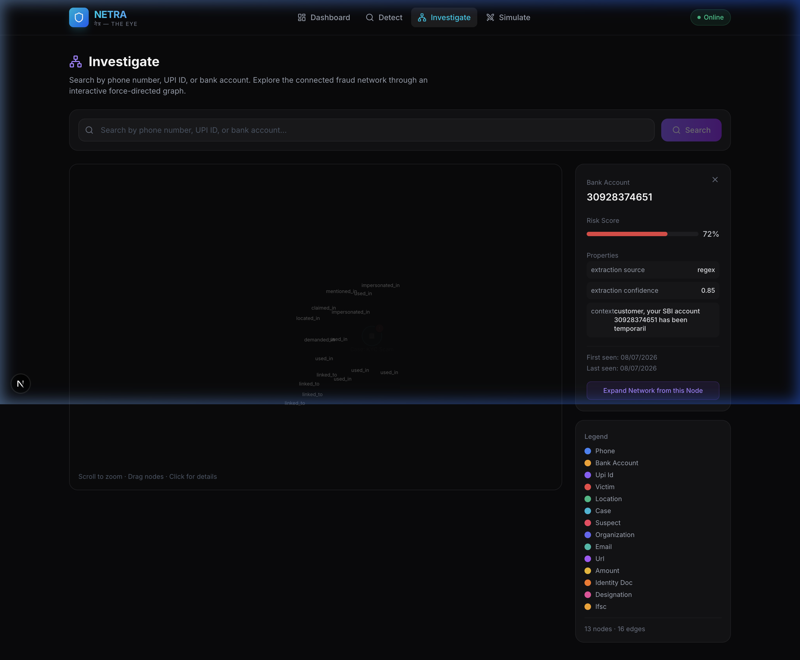
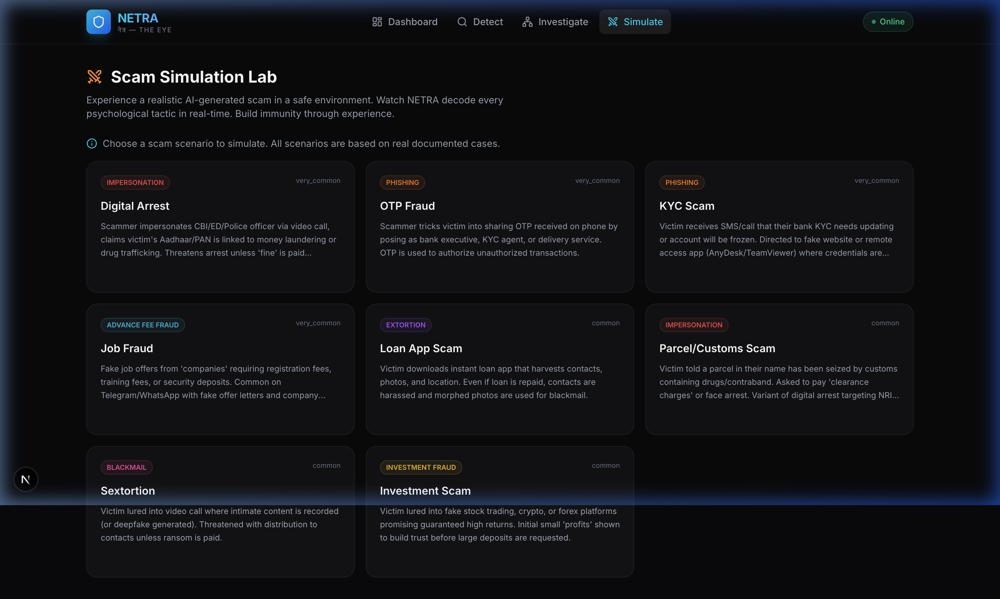

<p align="center">
  
</p>

<h1 align="center">NETRA — National Electronic Threat Recognition & Analysis</h1>

<p align="center">
  <strong>AI-Powered Digital Public Safety Intelligence Platform for India</strong>
</p>

<p align="center">
  <a href="#features">Features</a> •
  <a href="#architecture">Architecture</a> •
  <a href="#tech-stack">Tech Stack</a> •
  <a href="#getting-started">Getting Started</a> •
  <a href="#api-reference">API Reference</a> •
  <a href="#research">Research</a> •
  <a href="#license">License</a>
</p>

<p align="center">
  
  
  
  
  
  
</p>

---

## The Problem

India faces an **epidemic of digital fraud**. In 2024 alone:

- **₹11,333 crore** lost to cyber fraud (MHA data, Indian Cyber Crime Coordination Centre)
- **31 lakh+ complaints** registered on the National Cyber Crime Reporting Portal
- **"Digital Arrest" scams** emerged as the #1 threat — impersonating police/CBI to extort victims via video call
- Citizens, especially the elderly and less tech-literate, remain defenseless against sophisticated social engineering

Current solutions are **reactive** — victims file complaints *after* losing money. There is no national-scale tool for **real-time scam detection, proactive citizen training, and automated investigative intelligence**.

---

## What NETRA Does

**NETRA** (*National Electronic Threat Recognition & Analysis*) is a full-stack AI platform that treats digital fraud as a **cyber-threat intelligence problem**, not just a classification task.

### 🔍 Detect — Multi-Modal Scam Analysis
Upload suspicious messages (text, screenshots, URLs) and NETRA performs:
- **Kill Chain™ Decomposition**: Maps the scam across 6 attack stages (Contact → Pretext → Pressure → Extraction → Control → Concealment)
- **Psychological Tactic Detection**: Identifies manipulation techniques (authority impersonation, urgency creation, fear induction)
- **Legal Section Mapping**: Maps applicable IPC, IT Act, and BNS sections with penalties
- **Victim Vulnerability Scoring**: Assesses how dangerous the scam is based on sophistication and targeting
- **SHA-256 Evidence Hashing**: Cryptographic chain-of-custody for forensic admissibility

### 📸 Multi-Modal Input
- **Text Paste**: WhatsApp messages, SMS, emails, call transcripts
- **Screenshot OCR**: Upload WhatsApp/SMS screenshots — Gemini Vision extracts text automatically
- **Counterfeit Currency**: Upload banknote photos for RBI security feature analysis (10-point verification)
- **Voice Input**: Web Speech API for real-time Hindi/English dictation

### 🕸️ Investigate — Automated Fraud Network Intelligence
- **Auto-Entity Extraction**: Dual-stage regex + LLM NER pipeline extracts phones, UPI IDs, bank accounts, Aadhaar numbers, PANs, URLs, persons, organizations, amounts — from every analyzed case
- **Graph Auto-Population**: Extracted entities are automatically linked into a fraud network graph with risk scoring
- **Cross-Case Syndicate Detection**: Entities appearing across multiple cases are flagged as potential syndicate nodes
- **Interactive D3 Graph Visualization**: Force-directed graph with expandable node neighborhoods

### ⚔️ Simulate — Adversarial Scam Training
- **AI-Powered Scam Simulations**: Experience realistic Digital Arrest, KYC, and Investment scam scenarios
- **Dynamic Difficulty**: AI adapts pressure based on your responses
- **Intervention Engine**: NETRA intervenes when it detects you might be falling for the simulation
- **Debrief Analysis**: Post-simulation analysis of where you were vulnerable, with psychological resilience tips

### 📊 Command Center Dashboard
- **Real-Time D3 Charts**: Scam type distribution (donut), entity breakdown (bar), risk entity table
- **Live Threat Feed**: Real-time stream of detected scams and simulations
- **Agent System Status**: Monitor all 5 AI agents (Detection, Entity Extraction, Graph, Vision OCR, Simulation)
- **Analytics API**: Chart-ready data endpoints for programmatic access

### 🚨 Government Alert Generation
- **I4C/NCRB Format**: Auto-generates formal alert documents compatible with Indian Cyber Crime Coordination Centre filing
- **Forensic Dossier PDF**: Downloadable evidence package with kill chain analysis, entity map, and legal sections
- **1930 Helpline Integration**: Direct guidance for the National Cyber Crime Helpline

---

## Screenshots

<table>
  <tr>
    <td width="50%">
      
      <p align="center"><strong>Command Center</strong> — Real-time D3 charts, metrics, threat feed</p>
    </td>
    <td width="50%">
      
      <p align="center"><strong>Detect</strong> — Multi-modal input (text, screenshot, counterfeit)</p>
    </td>
  </tr>
  <tr>
    <td width="50%">
      
      <p align="center"><strong>Investigate</strong> — Auto-populated fraud network graph</p>
    </td>
    <td width="50%">
      
      <p align="center"><strong>Simulate</strong> — Adversarial AI scam training</p>
    </td>
  </tr>
</table>

---

## Architecture

```
┌─────────────────────────────────────────────────────────────────┐
│                    NETRA — System Architecture                   │
├─────────────────────────────────────────────────────────────────┤
│                                                                 │
│  ┌─────────────────────────────────────────────────────────┐   │
│  │                    FRONTEND (Next.js 15)                 │   │
│  │                                                          │   │
│  │  ┌──────────┐ ┌──────────┐ ┌────────────┐ ┌──────────┐ │   │
│  │  │Dashboard │ │  Detect  │ │Investigate │ │ Simulate │ │   │
│  │  │ D3 Charts│ │ Multi-   │ │ D3 Force   │ │ AI Chat  │ │   │
│  │  │ Metrics  │ │ Modal    │ │ Graph      │ │ Debrief  │ │   │
│  │  │ Feed     │ │ Voice    │ │ Auto-load  │ │ Intervn  │ │   │
│  │  └──────────┘ └──────────┘ └────────────┘ └──────────┘ │   │
│  │                                                          │   │
│  │  Components: Navbar │ Charts │ FraudGraph │ VoiceInput  │   │
│  └──────────────────────────┬──────────────────────────────┘   │
│                              │ REST API                         │
│  ┌──────────────────────────▼──────────────────────────────┐   │
│  │                   BACKEND (FastAPI)                       │   │
│  │                                                          │   │
│  │  ┌─────────────────────────────────────────────────────┐ │   │
│  │  │                  API ROUTERS                         │ │   │
│  │  │  detect.py │ graph.py │ dashboard.py │ simulate.py  │ │   │
│  │  │  22 endpoints total                                  │ │   │
│  │  └────────────────────┬────────────────────────────────┘ │   │
│  │                       │                                   │   │
│  │  ┌────────────────────▼────────────────────────────────┐ │   │
│  │  │               SERVICE LAYER                          │ │   │
│  │  │  llm.py (Gemini 2.5 Flash, Vision, Fallback)        │ │   │
│  │  │  entity_extraction.py (Regex + LLM NER)             │ │   │
│  │  │  graph_population.py (Auto-link + Risk Score)        │ │   │
│  │  └────────────────────┬────────────────────────────────┘ │   │
│  │                       │                                   │   │
│  │  ┌────────────────────▼────────────────────────────────┐ │   │
│  │  │               DATA LAYER                             │ │   │
│  │  │  SQLite + SQLAlchemy Async                           │ │   │
│  │  │  Tables: Cases │ Simulations │ GraphNodes │          │ │   │
│  │  │          GraphEdges │ LegalSections │ AuditLogs      │ │   │
│  │  └─────────────────────────────────────────────────────┘ │   │
│  └──────────────────────────────────────────────────────────┘   │
│                                                                 │
│  ┌──────────────────────────────────────────────────────────┐   │
│  │                  AI / ML LAYER                            │   │
│  │  Primary: Google Gemini 2.5 Flash (text + vision)         │   │
│  │  Fallback: Groq Llama 3 → Rule-based heuristics           │   │
│  │  NER: Regex patterns (Indian formats) + LLM extraction     │   │
│  │  Graph: Bayesian risk propagation across entity network     │   │
│  └──────────────────────────────────────────────────────────┘   │
└─────────────────────────────────────────────────────────────────┘
```

---

## Tech Stack

| Layer | Technology | Purpose |
|-------|-----------|---------|
| **Frontend** | Next.js 15 (Turbopack) | React server components, fast dev |
| **UI Animation** | Framer Motion | Page transitions, micro-animations |
| **Charts** | D3.js v7 | Donut charts, bar charts, force graphs |
| **Styling** | Tailwind CSS 4 | Glassmorphism design system |
| **Icons** | Lucide React | 100+ consistent vector icons |
| **Backend** | FastAPI 0.115 | Async Python API, auto-docs |
| **AI Engine** | Google Gemini 2.5 Flash | Text analysis, vision OCR, structured output |
| **AI Fallback** | Groq (Llama 3) | Fallback LLM when Gemini is rate-limited |
| **Database** | SQLite + SQLAlchemy Async | Lightweight, zero-config persistence |
| **Voice** | Web Speech API | Browser-native Hindi/English dictation |
| **Evidence** | SHA-256 | Cryptographic hashing for chain-of-custody |

---

## Getting Started

### Prerequisites

- **Python 3.11+** with pip
- **Node.js 18+** with npm
- **Google Gemini API Key** (free tier at [aistudio.google.com](https://aistudio.google.com))
- *(Optional)* Groq API Key for fallback LLM

### 1. Clone the Repository

```bash
git clone https://github.com/bhaskarkarn1/NETRA.git
cd NETRA
```

### 2. Backend Setup

```bash
cd backend

# Create virtual environment
python3 -m venv venv
source venv/bin/activate  # On Windows: venv\Scripts\activate

# Install dependencies
pip install -r requirements.txt

# Configure environment
cp .env.example .env
# Edit .env and add your API keys:
#   GEMINI_API_KEY=your_gemini_key_here
#   GROQ_API_KEY=your_groq_key_here (optional)

# Initialize database (auto-creates on first run)
# Seed legal sections data
python -m app.data.seed_graph

# Start the server
uvicorn app.main:app --host 0.0.0.0 --port 8000 --reload
```

The backend will be running at `http://localhost:8000`. Visit `http://localhost:8000/docs` for interactive API documentation.

### 3. Frontend Setup

```bash
cd frontend

# Install dependencies
npm install

# Start the development server
npm run dev
```

The frontend will be running at `http://localhost:3000`.

### 4. Verify Installation

```bash
# Check backend health
curl http://localhost:8000/api/dashboard/metrics

# Expected output:
# {"total_cases_analyzed": 0, "total_scams_detected": 0, ...}
```

Open `http://localhost:3000` in your browser — you should see the NETRA Command Center.

---

## API Reference

NETRA exposes **22 REST API endpoints** organized into 4 modules. Full interactive documentation is available at `/docs` (Swagger UI) when the backend is running.

### Detection API (`/api/detect`)

| Method | Endpoint | Description |
|--------|----------|-------------|
| `POST` | `/api/detect` | Analyze suspicious text — returns kill chain, tactics, legal sections, risk score |
| `POST` | `/api/detect/image` | Upload screenshot → OCR → full detection pipeline |
| `POST` | `/api/detect/counterfeit` | Analyze banknote image for RBI security features |
| `GET` | `/api/detect/{case_id}` | Retrieve a specific case by ID |
| `GET` | `/api/detect/{case_id}/dossier` | Download forensic PDF dossier |
| `GET` | `/api/detect/{case_id}/intelligence` | Cross-case pattern analysis & syndicate detection |
| `GET` | `/api/detect/{case_id}/alert` | Generate MHA/NCRB/I4C format alert document |
| `GET` | `/api/detect/recent/list` | List recently analyzed cases |

### Graph Intelligence API (`/api/graph`)

| Method | Endpoint | Description |
|--------|----------|-------------|
| `GET` | `/api/graph/search` | Search entities by phone, UPI ID, bank account, etc. |
| `GET` | `/api/graph/node/{node_id}` | Get entity details with risk score |
| `GET` | `/api/graph/network/{node_id}` | Get entity's connected fraud network |
| `GET` | `/api/graph/recent` | Recently discovered entities |
| `GET` | `/api/graph/stats` | Graph ecosystem statistics |
| `POST` | `/api/graph/propagate-risk` | **Bayesian risk propagation** across graph edges |
| `GET` | `/api/graph/communities` | **Community detection** — BFS syndicate clustering |
| `GET` | `/api/graph/intervention/{node_id}` | **Causal intervention** — "what if we freeze this?" |

### Simulation API (`/api/simulate`)

| Method | Endpoint | Description |
|--------|----------|-------------|
| `GET` | `/api/simulate/scenarios` | List available scam simulation scenarios |
| `POST` | `/api/simulate/start` | Start a new adversarial scam simulation |
| `POST` | `/api/simulate/{id}/respond` | Send a response to the simulated scammer |
| `GET` | `/api/simulate/{id}/debrief` | Get post-simulation vulnerability analysis |

### Dashboard API (`/api/dashboard`)

| Method | Endpoint | Description |
|--------|----------|-------------|
| `GET` | `/api/dashboard/metrics` | Real-time platform metrics |
| `GET` | `/api/dashboard/threat-feed` | Live threat activity feed |
| `GET` | `/api/dashboard/analytics` | Chart-ready analytics (scam distribution, entity breakdown, daily trends) |
| `GET` | `/api/dashboard/geospatial` | **Geospatial threat data** — geocoded scam locations with NCRB hotspot overlay |

---

## Kill Chain™ Framework

NETRA introduces a **6-stage Cyber Fraud Kill Chain** — inspired by Lockheed Martin's Cyber Kill Chain but adapted specifically for Indian social engineering attacks:

```
┌──────────┐   ┌──────────┐   ┌──────────┐   ┌────────────┐   ┌──────────┐   ┌────────────┐
│ S1       │   │ S2       │   │ S3       │   │ S4         │   │ S5       │   │ S6         │
│ CONTACT  │──▶│ PRETEXT  │──▶│ PRESSURE │──▶│ EXTRACTION │──▶│ CONTROL  │──▶│ CONCEALMENT│
│          │   │          │   │          │   │            │   │          │   │            │
│ Initial  │   │ Cover    │   │ Urgency  │   │ Data/Money │   │ Maintain │   │ Cover      │
│ approach │   │ story    │   │ & fear   │   │ theft      │   │ hold     │   │ tracks     │
└──────────┘   └──────────┘   └──────────┘   └────────────┘   └──────────┘   └────────────┘
```

Each stage is scored with:
- **Confidence level** (0-1)
- **Evidence text** extracted from the original message
- **Progression indicator** showing how far the attack has evolved

This framework enables law enforcement to understand **exactly where in the attack lifecycle** a victim was targeted.

---

## Entity Extraction Pipeline

NETRA uses a **dual-stage NER (Named Entity Recognition)** approach:

### Stage 1: Regex Pattern Matching
Purpose-built patterns for Indian financial entities:
- **Phone Numbers**: `+91-XXXXX-XXXXX`, `98XXXXXXXX`
- **UPI IDs**: `name@upi`, `name@paytm`, `name@ybl`
- **Bank Accounts**: 9-18 digit account numbers
- **IFSC Codes**: `SBIN0001234` format
- **Aadhaar Numbers**: `XXXX XXXX XXXX` (12-digit)
- **PAN Numbers**: `ABCDE1234F` format
- **URLs**: HTTP/HTTPS links
- **Monetary Amounts**: `₹50,000`, `Rs. 1,00,000`, `INR 50000`

### Stage 2: LLM-Based Extraction
Gemini 2.5 Flash extracts contextual entities that regex cannot:
- **Persons**: Names mentioned in conversation
- **Organizations**: Banks, government agencies, companies
- **Locations**: Cities, states, addresses
- **Designations**: "Inspector", "Manager", "Officer"
- **Identity Documents**: References to Aadhaar, PAN, passport

### Auto-Population
Every extracted entity is automatically:
1. Deduplicated against existing graph nodes
2. Assigned a Bayesian risk score
3. Linked to the originating case via `GraphEdge`
4. Flagged if it appears across multiple cases (syndicate indicator)

---

## Project Structure

```
NETRA/
├── backend/
│   ├── app/
│   │   ├── agents/
│   │   │   └── detection.py        # Detection Agent — LLM prompt engineering
│   │   ├── data/
│   │   │   └── seed_graph.py       # Legal sections seed data (IPC, IT Act, BNS)
│   │   ├── routers/
│   │   │   ├── dashboard.py        # Metrics, threat feed, analytics endpoints
│   │   │   ├── detect.py           # Core detection, image OCR, counterfeit, alerts
│   │   │   ├── graph.py            # Fraud network graph CRUD & search
│   │   │   └── simulate.py         # Adversarial simulation engine
│   │   ├── services/
│   │   │   ├── entity_extraction.py # Dual-stage NER (regex + LLM)
│   │   │   ├── graph_population.py  # Auto-graph population & risk scoring
│   │   │   └── llm.py              # LLM service (Gemini + Groq + fallback)
│   │   ├── config.py               # Environment configuration
│   │   ├── database.py             # SQLAlchemy async models & engine
│   │   └── main.py                 # FastAPI application entry point
│   ├── requirements.txt
│   └── .env.example
│
├── frontend/
│   ├── src/
│   │   ├── app/
│   │   │   ├── page.tsx             # Command Center dashboard
│   │   │   ├── detect/page.tsx      # Multi-modal detection page
│   │   │   ├── investigate/page.tsx # Fraud network graph explorer
│   │   │   ├── simulate/page.tsx    # Adversarial simulation trainer
│   │   │   ├── layout.tsx           # Root layout with navbar
│   │   │   └── globals.css          # Design system & glassmorphism tokens
│   │   ├── components/
│   │   │   ├── charts/
│   │   │   │   └── dashboard-charts.tsx  # D3 donut, bar, risk table
│   │   │   ├── graph/
│   │   │   │   └── fraud-graph.tsx       # D3 force-directed fraud graph
│   │   │   └── shared/
│   │   │       └── navbar.tsx            # Navigation with active states
│   │   ├── hooks/
│   │   │   └── use-voice-input.ts   # Web Speech API hook (en-IN)
│   │   └── lib/
│   │       ├── api.ts               # REST API client with error handling
│   │       ├── types.ts             # TypeScript interfaces & enums
│   │       └── utils.ts             # Utility functions (cn, formatting)
│   ├── package.json
│   └── tsconfig.json
│
└── docs/
    └── screenshots/                 # Application screenshots
```

---

## Key Technical Differentiators

| Feature | Description | Why It Matters |
|---------|-------------|----------------|
| **Kill Chain Decomposition** | 6-stage attack lifecycle mapping | Goes beyond binary "scam/not-scam" — shows attack progression |
| **Auto-Entity Extraction** | Dual-stage regex + LLM NER | No manual tagging — entities populate the fraud graph automatically |
| **Cross-Case Intelligence** | Entities linked across cases | Detects organized fraud syndicates using shared phone/UPI/bank data |
| **Multi-Modal Input** | Text + Screenshot OCR + Voice + Counterfeit | Meets victims where they are — WhatsApp screenshots, voice reports |
| **Adversarial Simulation** | AI-powered scam role-play with intervention | Proactive defense — trains citizens *before* they become victims |
| **Government-Format Alerts** | I4C/NCRB compliant documents | Ready for direct filing with Indian Cyber Crime Coordination Centre |
| **Evidence Chain-of-Custody** | SHA-256 hashing + audit logs | Forensic-grade evidence preservation for legal proceedings |
| **Graceful AI Degradation** | Gemini → Groq → Rule-based fallback | Never fails — always produces a result even if all LLMs are down |

---

## Research Foundation

NETRA draws on published research in:

- **Social Engineering Kill Chains**: Adapted from Mitnick's attack lifecycle and Lockheed Martin's Cyber Kill Chain for social engineering contexts
- **Cialdini's Principles of Influence**: Authority, scarcity, social proof — mapped to Indian scam tactics
- **Graph-Based Fraud Detection**: Entity relationship networks for syndicate identification (Hamilton et al., "Inductive Representation Learning on Large Graphs", NeurIPS 2017)
- **Adversarial Training**: Using AI role-play for psychological resilience training against phishing (Kumaraguru et al., "Teaching Johnny Not to Fall for Phish", ACM TOPS 2010)
- **Indian Regulatory Framework**: IPC Sections 419/420, IT Act Sections 66C/66D, and new BNS 2023 provisions

---

## Roadmap

### Completed ✅

- [x] **Geospatial Crime Map**: MapLibre GL JS heat map of scam origins across India (CARTO dark tiles, NCRB hotspot data)
- [x] **Bayesian Risk Propagation**: Risk scores flow across graph edges with iterative belief propagation
- [x] **Community Detection**: BFS connected components for automatic syndicate clustering
- [x] **Causal Intervention Simulator**: "What if we freeze this entity?" counterfactual analysis
- [x] **Multi-Modal Input**: Text, screenshot OCR (Gemini Vision), counterfeit currency analysis
- [x] **MHA/NCRB Alert Generation**: I4C-compliant legal alert documents
- [x] **Voice Input**: Web Speech API integration (en-IN for Hindi-English)
- [x] **D3.js Dashboard**: Donut charts, bar charts, risk tables, live analytics

### Planned 🚀

- [ ] **Multilingual Support**: Hindi, Tamil, Telugu, Bengali scam analysis
- [ ] **Browser Extension**: Chrome extension for real-time SMS/WhatsApp scanning
- [ ] **Mobile App**: React Native companion app with camera-first UX
- [ ] **Real-time Streaming**: WebSocket-based live threat feed
- [ ] **PDF Report Export**: One-click forensic dossier as PDF

---

## Environment Variables

Create a `.env` file in the `backend/` directory:

```env
# Required
GEMINI_API_KEY=your_gemini_api_key

# Optional — fallback LLM
GROQ_API_KEY=your_groq_api_key

# Optional — geospatial
MAPBOX_TOKEN=your_mapbox_token

# Application
LOG_LEVEL=INFO
DATABASE_URL=sqlite+aiosqlite:///./netra.db
```

---

## Contributing

1. Fork the repository
2. Create a feature branch: `git checkout -b feature/your-feature`
3. Commit changes: `git commit -am 'Add your feature'`
4. Push to branch: `git push origin feature/your-feature`
5. Open a Pull Request

---

## License

This project is licensed under the MIT License — see the [LICENSE](LICENSE) file for details.

---

## Acknowledgments

- **Google AI Studio** — Gemini 2.5 Flash API for powering core AI analysis
- **Indian Cyber Crime Coordination Centre (I4C)** — For the complaint format standards that inspired our alert generation
- **National Crime Records Bureau (NCRB)** — For cybercrime statistics that informed our threat models
- **Reserve Bank of India** — For the banknote security feature specifications used in counterfeit detection

---

<p align="center">
  <strong>NETRA</strong> — Built for India's digital safety. Powered by AI. 🇮🇳
</p>
