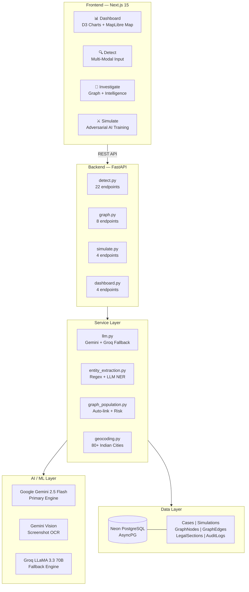
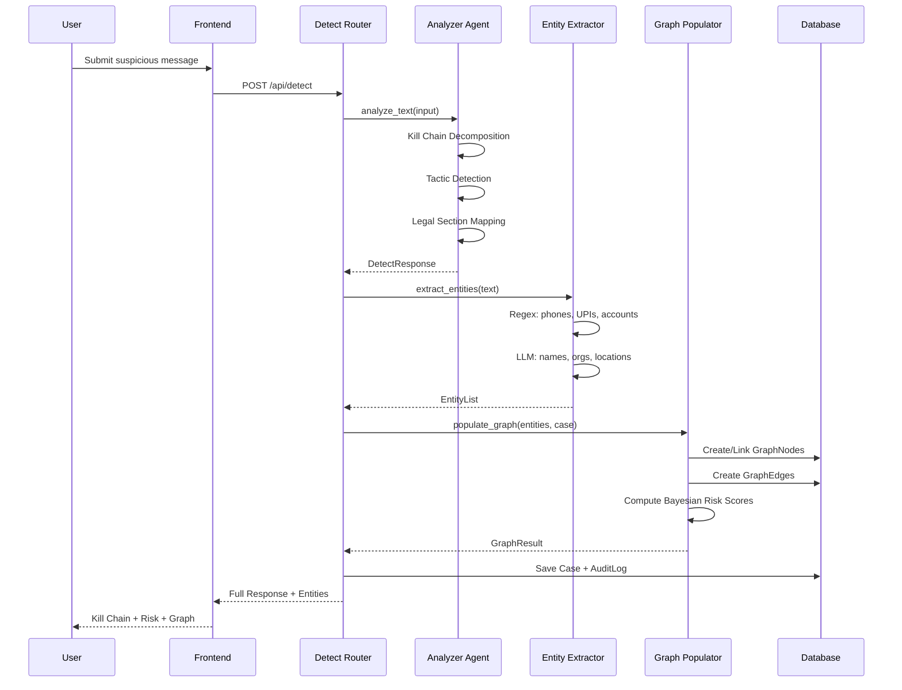
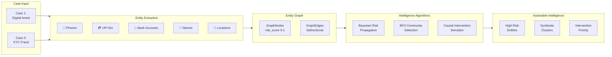

# NETRA — Architecture Diagrams

## System Architecture (High-Level)

```mermaid
graph TB
    subgraph Frontend["Frontend — Next.js 15"]
        Dashboard["📊 Dashboard<br/>D3 Charts + MapLibre Map"]
        Detect["🔍 Detect<br/>Multi-Modal Input"]
        Investigate["🔗 Investigate<br/>Graph + Intelligence"]
        Simulate["⚔️ Simulate<br/>Adversarial AI Training"]
    end

    subgraph Backend["Backend — FastAPI"]
        DR["detect.py<br/>22 endpoints"]
        GR["graph.py<br/>8 endpoints"]
        SR["simulate.py<br/>4 endpoints"]
        DBR["dashboard.py<br/>4 endpoints"]
    end

    subgraph Services["Service Layer"]
        LLM["llm.py<br/>Gemini + Groq Fallback"]
        EE["entity_extraction.py<br/>Regex + LLM NER"]
        GP["graph_population.py<br/>Auto-link + Risk"]
        GC["geocoding.py<br/>80+ Indian Cities"]
    end

    subgraph AI["AI / ML Layer"]
        Gemini["Google Gemini 2.5 Flash<br/>Primary Engine"]
        Vision["Gemini Vision<br/>Screenshot OCR"]
        Groq["Groq LLaMA 3.3 70B<br/>Fallback Engine"]
    end

    subgraph Data["Data Layer"]
        DB[("Neon PostgreSQL<br/>AsyncPG")]
        Tables["Cases | Simulations<br/>GraphNodes | GraphEdges<br/>LegalSections | AuditLogs"]
    end

    Frontend -->|REST API| Backend
    Backend --> Services
    Services --> AI
    Services --> Data
    DB --- Tables
```

## Detection Pipeline (Data Flow)

```mermaid
sequenceDiagram
    participant U as User
    participant F as Frontend
    participant D as Detect Router
    participant A as Analyzer Agent
    participant E as Entity Extractor
    participant G as Graph Populator
    participant DB as Database

    U->>F: Submit suspicious message
    F->>D: POST /api/detect
    D->>A: analyze_text(input)
    A->>A: Kill Chain Decomposition
    A->>A: Tactic Detection
    A->>A: Legal Section Mapping
    A-->>D: DetectResponse
    D->>E: extract_entities(text)
    E->>E: Regex: phones, UPIs, accounts
    E->>E: LLM: names, orgs, locations
    E-->>D: EntityList
    D->>G: populate_graph(entities, case)
    G->>DB: Create/Link GraphNodes
    G->>DB: Create GraphEdges
    G->>G: Compute Bayesian Risk Scores
    G-->>D: GraphResult
    D->>DB: Save Case + AuditLog
    D-->>F: Full Response + Entities
    F-->>U: Kill Chain + Risk + Graph
```

## Graph Intelligence (Research-Grade)

```mermaid
graph LR
    subgraph Input["Case Input"]
        C1["Case 1:<br/>Digital Arrest"]
        C2["Case 2:<br/>KYC Fraud"]
    end

    subgraph Extraction["Entity Extraction"]
        P["📱 Phones"]
        U["💳 UPI IDs"]
        B["🏦 Bank Accounts"]
        N["👤 Names"]
        L["📍 Locations"]
    end

    subgraph Graph["Entity Graph"]
        GN["GraphNodes<br/>risk_score 0-1"]
        GE["GraphEdges<br/>bidirectional"]
    end

    subgraph Intelligence["Intelligence Algorithms"]
        BP["Bayesian Risk<br/>Propagation"]
        CD["BFS Community<br/>Detection"]
        CI["Causal Intervention<br/>Simulator"]
    end

    subgraph Output["Actionable Intelligence"]
        HR["High-Risk<br/>Entities"]
        SY["Syndicate<br/>Clusters"]
        PR["Intervention<br/>Priority"]
    end

    C1 --> Extraction
    C2 --> Extraction
    Extraction --> Graph
    Graph --> Intelligence
    Intelligence --> Output
```

## Kill Chain Framework

```mermaid
graph LR
    S1["📡 S1: CONTACT<br/>Initial approach"]
    S2["🎭 S2: PRETEXT<br/>Cover story"]
    S3["⚡ S3: PRESSURE<br/>Urgency & fear"]
    S4["🔒 S4: ISOLATION<br/>Cut off support"]
    S5["💰 S5: EXTRACTION<br/>Money/data theft"]
    S6["🧹 S6: CONCEALMENT<br/>Cover tracks"]

    S1 -->|"escalation"| S2
    S2 -->|"trust built"| S3
    S3 -->|"victim panics"| S4
    S4 -->|"compliance"| S5
    S5 -->|"evidence"| S6

    style S1 fill:#3b82f6,color:#fff
    style S2 fill:#8b5cf6,color:#fff
    style S3 fill:#f97316,color:#fff
    style S4 fill:#ef4444,color:#fff
    style S5 fill:#dc2626,color:#fff
    style S6 fill:#991b1b,color:#fff
```
